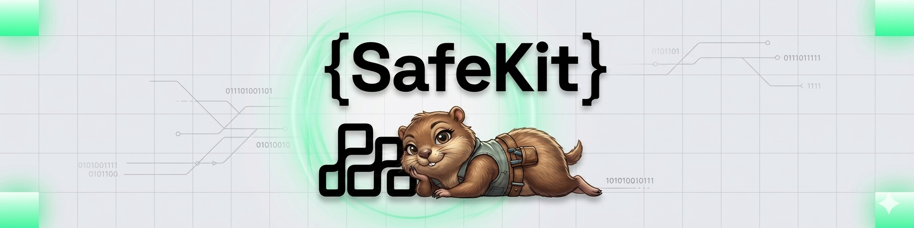

<p align="center">
  <a href="https://github.com/spazzle-io/safekit">
    
  </a>
</p>

<p align="center">
  <em>Go library for deploying and predicting Gnosis Safe multisig wallet addresses on any EVM chain.</em>
</p>

<p align="center">
  
  
  <a href="https://pkg.go.dev/github.com/spazzle-io/safekit">
    
  </a>
  <a href="https://codecov.io/gh/spazzle-io/safekit">
    
  </a>
  <a href="https://results.pre-commit.ci/latest/github/spazzle-io/safekit/main">
    
  </a>
</p>

---

There is no official Go SDK for Gnosis Safe (now Safe{Wallet}). SafeKit fills that gap.

It lets you predict the address a Safe will be deployed to before it exists on-chain, and deploy it when you are ready. The predicted address is verified against the deployed address on every deployment so you always know they match.

Supports Safe v1.3.0, v1.4.1, and v1.5.0 on any EVM-compatible chain.

## Requirements

- Go 1.24+
- An Ethereum-compatible JSON-RPC endpoint
- A funded admin wallet to pay for gas (never added as a Safe owner)

## Installation

```bash
go get github.com/spazzle-io/safekit
```

Full API reference is available on [pkg.go.dev](https://pkg.go.dev/github.com/spazzle-io/safekit).

## Quick start

```go
package main

import (
    "context"
    "fmt"
    "log"
    "os"

    "github.com/ethereum/go-ethereum/common"
    "github.com/spazzle-io/safekit/pkg/chain"
    "github.com/spazzle-io/safekit/pkg/safe"
    "github.com/spazzle-io/safekit/pkg/signer"
    "github.com/spazzle-io/safekit/pkg/version"
)

func main() {
    // load the signer from an environment variable
    s, err := signer.NewEnvSigner("ADMIN_WALLET_PRIVATE_KEY")
    if err != nil {
        log.Fatal(err)
    }

    // if your private key is already in memory (e.g. loaded from a secrets manager),
    // use NewSignerFromHex instead:
    //
    //   s, err := signer.NewSignerFromHex(adminWalletPrivateKeyString)
    //
    // for production workloads, prefer a signer backed by a hardware security
    // module or secrets manager such as AWS KMS or HashiCorp Vault.

    client, err := safe.New(safe.Options{
        Chain:   chain.Ethereum,
        RPC:     os.Getenv("RPC_URL"),
        Signer:  s,
        Version: version.V141,
    })
    if err != nil {
        log.Fatal(err)
    }
    defer client.Close()

    owners := []common.Address{
        common.HexToAddress("0x1111111111111111111111111111111111111111"),
        common.HexToAddress("0x2222222222222222222222222222222222222222"),
        common.HexToAddress("0x3333333333333333333333333333333333333333"),
    }

    salt, err := safe.RandomSalt()
    if err != nil {
        log.Fatal(err)
    }

    // predict the address before deploying
    // predicting an address is pure computation. It doesn't make network calls,
    // on-chain transactions, or consume gas.
    addr, err := client.PredictAddress(owners, 2, salt)
    if err != nil {
        log.Fatal(err)
    }
    fmt.Println("Safe will be deployed to:", addr.Hex())

    // deploy when ready
    result, err := client.Deploy(context.Background(), owners, 2, salt)
    if err != nil {
        log.Fatal(err)
    }
    fmt.Println("Deployed to:", result.SafeAddress.Hex())
    fmt.Println("Transaction:", result.TxHash.Hex())
}
```

## Deterministic addresses

The same owners, threshold, and salt values always produce the same address on the same chain and version. This lets you know the wallet address before it has been deployed; allowing you to fund it in advance and deploy later.

```go
// store this in your database before deploying
addr, err := client.PredictAddress(owners, threshold, []byte(userID))

// same call later produces the same address
addr, err := client.PredictAddress(owners, threshold, []byte(userID))

// deploy when ready
result, err := client.Deploy(ctx, owners, threshold, []byte(userID))

// result.SafeAddress == addr, always
```

For random one-off Safes where you do not need reproducibility, use `safe.RandomSalt()` instead.

## Supported versions

| Version | Status      | Notes                                      |
|---------|-------------|--------------------------------------------|
| v1.3.0  | Supported   | Legacy. Prefer v1.4.1 for new deployments. |
| v1.4.1  | Recommended | Broad chain coverage, battle-tested.       |
| v1.5.0  | Supported   | Latest. Chain coverage still expanding.    |

Check [Safe's supported networks](https://docs.safe.global/advanced/smart-account-supported-networks) for chain coverage per version.

## Supported chains

SafeKit ships with built-in support for the following chains:

| Chain            | ID       |
|------------------|----------|
| Ethereum         | 1        |
| Polygon          | 137      |
| Polygon zkEVM    | 1101     |
| Polygon Amoy     | 80002    |
| Arbitrum One     | 42161    |
| Arbitrum Nova    | 42170    |
| Arbitrum Sepolia | 421614   |
| Base             | 8453     |
| Optimism         | 10       |
| Optimism Sepolia | 11155420 |
| BNB Smart Chain  | 56       |
| BSC Testnet      | 97       |
| Ethereum Sepolia | 11155111 |
| Base Sepolia     | 84532    |

The full list is in `pkg/chain/known.go`. If your target chain is not listed,
you can register it before calling `safe.New`:

```go
chain.Register(&chain.Chain{
    ID:   big.NewInt(12345),
    Name: "my-chain",
    IsL2: true,
})

client, err := safe.New(safe.Options{
    Chain:   chain.Lookup(big.NewInt(12345)),
    ...
})
```

The chain must have Safe contracts deployed to it. Check the
[Safe deployments registry](https://github.com/safe-global/safe-deployments)
to confirm your chain is supported.

## Deployment options

`Deploy` blocks until the transaction is mined. If you need more control:

```go
// submit and get a hash immediately
txHash, err := client.SubmitDeployment(ctx, owners, threshold, salt)

// wait for it later
result, err := client.WaitForDeployment(ctx, owners, threshold, salt, txHash)

// or poll yourself
deployed, err := client.IsDeployed(ctx, predictedSafeAddress)
```

## Configuration

```go
client, err := safe.New(safe.Options{
    Chain:         chain.Base,
    RPC:           os.Getenv("RPC_URL"),
    Signer:        s,
    Version:       version.V141,
    DeployTimeout: 3 * time.Minute, // default: 5 minutes
    GasMultiplier: 1.3,             // default: 1.2
})
```

## Testing your application

SafeKit ships a mock client that implements the same interface as the real client. It uses real CREATE2 math so predicted and deployed addresses always agree, but makes no network calls.

```go
import "github.com/spazzle-io/safekit/testing/mock"

client := mock.NewClient()

addr, err := client.PredictAddress(owners, threshold, salt)
result, err := client.Deploy(ctx, owners, threshold, salt)

// result.SafeAddress == addr, always, no network needed
```

Your application code should depend on the `safe.Deployer` interface rather than `*safe.Client` directly. This makes swapping in the mock client trivial.

## License

This project is licensed under the terms of the MIT license.
